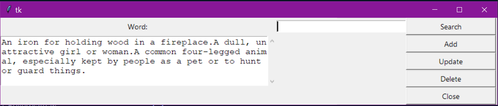

# Dictionary
  
  

<br>

A Python based application using Tkinter and MySQL to return word definitions



## Prerequisites

<a href="https://www.python.org/"></a>

<a href="https://pypi.org/project/pipenv/"></a>

pipenv

## Installation

pipenv install

```bash
pipenv install
```

## Usage

```bash
pipenv run dbapp.py
```

## Running Tests

```bash
N/A
```

## Deployment

[Live Site](N/A)

## Authors


[Jon Jackson](http://github.com/ocskier)

Please make sure to update tests as appropriate.

## License

MIT

